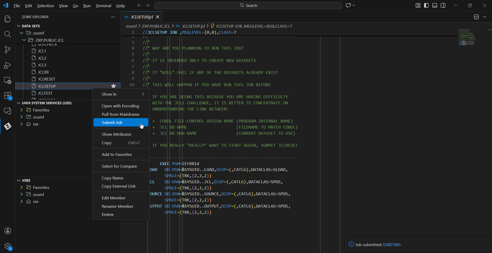

# Visual Guide – JCL1: Job Control Language

> A step-by-step visual walkthrough of submitting, debugging, and fixing JCL on IBM Z.

---

## Step-by-Step Screenshots

### ✅ Step 1: Initialize Environment
*Submitting the `JCLSETUP` job from `ZXP.PUBLIC.JCL`. This job allocates the `LOAD`, `SOURCE`, and `OUTPUT` datasets required for the challenge.*

---

### ✅ Step 2: Verify Setup
*Checking the JES Job output to confirm `JCLSETUP` finished with **CC 0000** (Condition Code 0). A code of 0000 indicates successful execution without errors.*

---

### ✅ Step 3: Debugging JCL1 (IEBGENER)
*The `JCL1` job initially fails because `IEBGENER` requires a `SYSIN` statement. Here, I am inspecting the JCL to ensure the Input (`SYSUT1`) and Output (`SYSUT2`) are correctly defined.*

---

### ✅ Step 4: Debugging JCL2 (COBOL Linkage)
*The `JCL2` job compiles a COBOL program. It failed initially because the JCL DD Name did not match the internal COBOL file name. I corrected line 27 to `//COMBINED` to match the `SELECT... ASSIGN TO COMBINED` statement in the source code.*

---

### ✅ Step 5: Working with In-Stream Data (JCL3)
*In `JCL3`, data is not read from a file but provided "in-stream" using `DD *`. Here, I am formatting the train schedule text to ensure no duplicate records exist and the header/footer information is correct.*

---

### ✅ Step 6: Workflow Overview
*A full view of the VS Code environment showing the Zowe Explorer on the left, the editor in the center, and the context menu used to submit jobs to the mainframe.*

---

## What I Learned

- **Condition Codes:** How to distinguish between success (0000), warning (0004), and severe errors (0012 or Abends).
- **DD (Data Definition):** The critical link between a program's internal logical file name and the actual physical dataset on the mainframe.
- **In-Stream Data:** How to pass data directly within JCL using `//DD *` rather than pointing to an external file.
- **Troubleshooting:** The process of submitting a job, checking `JESMSGLG` for errors, fixing the code, and resubmitting.

---

## Notes

- **IEBGENER:** A standard utility used for copying data (Sequential to Sequential, or PDS Member to Sequential).
- **SYSUID:** The JCL system symbol `&SYSUID` automatically replaces itself with my user ID (`Z87191`), making scripts portable.

---

## Contact

**Paarth Pandey**
[LinkedIn](https://www.linkedin.com/in/paarth-pandey-13779529b/) | [GitHub](https://github.com/paarthpandey10) | paarthdxb@gmail.com

---

## Credits

This lab is based on the [IBM Z Xplore Learning Platform](https://ibmzxplore.influitive.com/), provided by IBM.
Visuals, objectives, and task flows belong to IBM and are used under fair use for personal learning documentation.

—

> Author: [Paarth Pandey](https://github.com/paarthpandey10)
>
> IBM Z Xplore: Fundamentals
