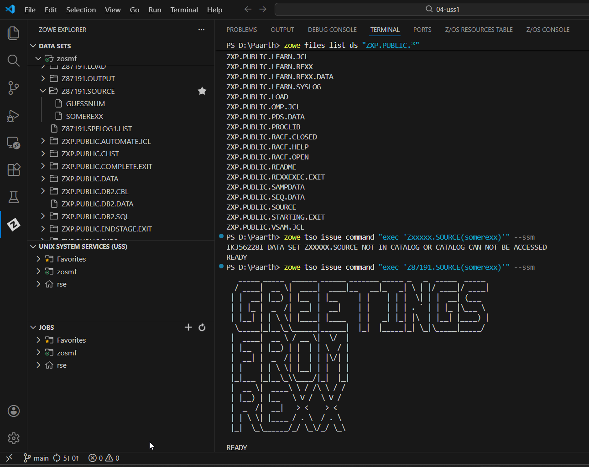
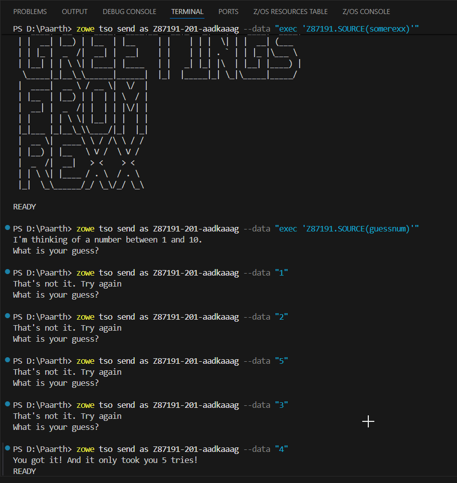

# Visual Guide – REXX1: Enterprise IT Duct Tape

> A step-by-step visual walkthrough of installing the Zowe CLI and executing interactive REXX scripts on z/OS.

---

## Step-by-Step Screenshots

### ✅ Step 1: Installing Zowe CLI
*Installing the Zowe Command Line Interface (CLI) on Windows. I used the Node Package Manager (`npm`) command `npm i -g @zowe/cli` to install the tools needed to interact with the mainframe from my local terminal.*

### ✅ Step 2: Setting Up the Workspace
*Using the Zowe Explorer extension in VS Code to prepare the source files. I copied the `SOMEREXX` and `GUESSNUM` members from the read-only `ZXP.PUBLIC.SOURCE` data set into my personal data set `Z87191.SOURCE`.*

### ✅ Step 3: Running Your First REXX Program
*Verifying the connection and running a simple script. First, I listed the public datasets using `zowe files list ds` to test my profile. Then, I executed `SOMEREXX` using the `zowe tso issue command`. It returned a large ASCII art greeting: "GREETINGS FROM REXX".*

### ✅ Step 4: Interactive TSO (The Guessing Game)
*Playing the `GUESSNUM` game. This required starting a persistent TSO Address Space (`zowe tso start as`) to handle interactive input. I sent guesses (1, 2, 5, 3) until I finally guessed the correct number (4) on the 5th try.*

### ✅ Step 5: Final Validation
*Checking the Zowe Explorer "JOBS" view to verify the submission. The validation job `@REXX1(JOB04939)` completed with **CC 0000**, confirming the challenge was passed successfully.*

---

## What I Learned

- **Zowe CLI:** How to install and use the command-line interface to interact with z/OS without needing a traditional 3270 terminal emulator.
- **REXX:** Introduction to the "Restructured Extended Executor" language, known for its simplicity and power in the mainframe environment.
- **TSO Address Spaces:** Understanding that interactive programs require a persistent address space (memory "ticket") to maintain state between commands.
- **Interactive Commands:** Using `zowe tso send as` to send data to a running program, allowing for interactive sessions like the number guessing game.

---

## Notes

- **User ID:** `Z87191`
- **Address Space Key:** `Z87191-201-aadkaaag` (used during the guessing game session).
- **Files Used:** `SOMEREXX`, `GUESSNUM`.

---

## Contact

**Paarth Pandey**
[LinkedIn](https://www.linkedin.com/in/paarth-pandey-13779529b/) | [GitHub](https://github.com/paarthpandey10) | paarthdxb@gmail.com

---

## Credits

This lab is based on the [IBM Z Xplore Learning Platform](https://ibmzxplore.influitive.com/), provided by IBM.
Visuals, objectives, and task flows belong to IBM and are used under fair use for personal learning documentation.

—

> Author: [Paarth Pandey](https://github.com/paarthpandey10)
>
> IBM Z Xplore: Fundamentals
