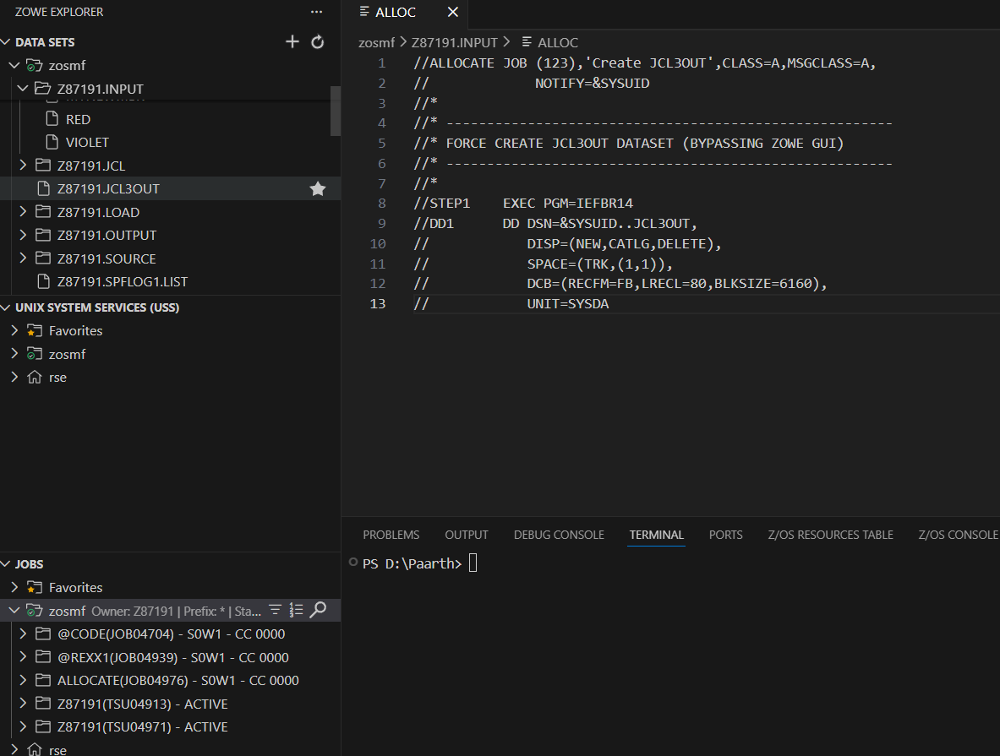
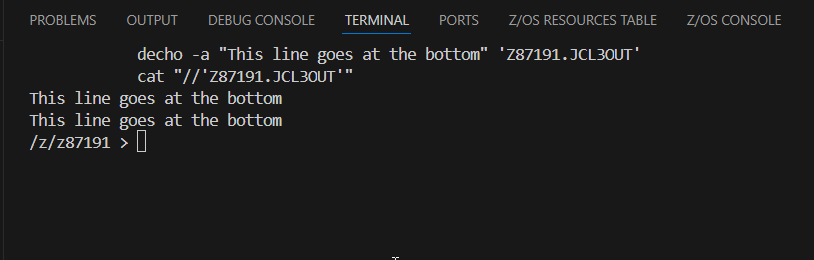
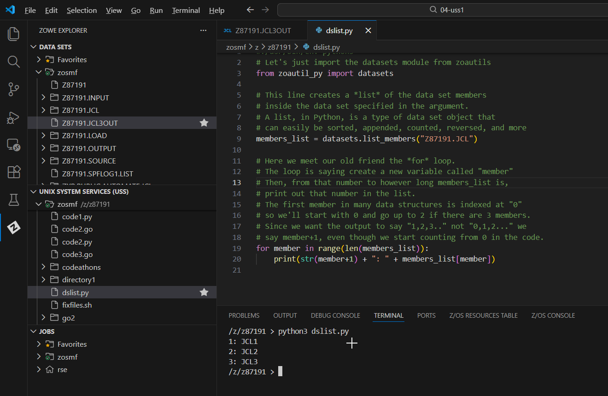

# Visual Guide – WRAPUP: Z Open Automation Utilities (ZOAU)

> A step-by-step visual walkthrough of using Python and ZOAU to automate z/OS system tasks.

---

## Step-by-Step Screenshots

### ✅ Step 1: Dataset Preparation
*Ensuring the target dataset `JCL3OUT` exists. I used the `ALLOC` JCL to create the necessary sequential file to ensure the subsequent steps would run smoothly.*

### ✅ Step 2: The DECHO Utility
*Using the `decho` command in the terminal. I executed `decho -a "This line goes at the bottom" 'Z87191.JCL3OUT'` to append text to the file without opening an editor. I verified it using `cat`.*

### ✅ Step 3: Listing Members with Python
*Running `dslist.py`. This script utilized the `zoautil_py` library to list members of a Partitioned Data Set (PDS). It successfully printed the members `JCL1`, `JCL2`, and `JCL3` from my JCL library.*

### ✅ Step 4: Coding the Automation Script
*Editing `members.py` to implement system logic. I made three key changes:*
1. *Fixed the creation line: `datasets.create(..., dataset_type="SEQ", ...)` to create a Sequential dataset.*
2. *Uncommented the linklist retrieval: `linklist_output = zsystem.list_linklist()`.*
3. *Ensured the write function passed the correct variables: `datasets.write(dsname, linklist_output, ...)`.*

### ✅ Step 5: Execution & Creation
*Running the finalized `members.py` script. The script prompted for a name (`COMPLETE`), asked to create it (Yes), and then populated `Z87191.COMPLETE` with the system's Linklist (e.g., `VENDOR.LINKLIB`, `SYS1.MIGLIB`).*

### ✅ Step 6: Final Validation
*Checking the Zowe Explorer "JOBS" view. The validation job `@AUTO(JOB05057)` completed with **CC 0000**, confirming that the script worked and the dataset was generated correctly.*

---

## What I Learned

- **ZOAU (Z Open Automation Utilities):** How to bridge the gap between traditional z/OS tasks and modern scripting languages like Python.
- **DECHO:** A handy command-line utility for quickly appending text to datasets without full interactive editing.
- **Python Modules:** Using `zoautil_py.datasets` to create/write files and `zoautil_py.zsystem` to query system information like the Linklist.
- **Automation Logic:** Writing a script that checks for file existence, prompts user input, and handles system data dynamically.

---

## Notes

- **User ID:** `Z87191`
- **Script Used:** `members.py`
- **Output Dataset:** `Z87191.COMPLETE` containing the system Linklist.

---

## Contact

**Paarth Pandey**
[LinkedIn](https://www.linkedin.com/in/paarth-pandey-13779529b/) | [GitHub](https://github.com/paarthpandey10) | paarthdxb@gmail.com

---

## Credits

This lab is based on the [IBM Z Xplore Learning Platform](https://ibmzxplore.influitive.com/), provided by IBM.
Visuals, objectives, and task flows belong to IBM and are used under fair use for personal learning documentation.

—

> Author: [Paarth Pandey](https://github.com/paarthpandey10)
>
> IBM Z Xplore: Fundamentals
