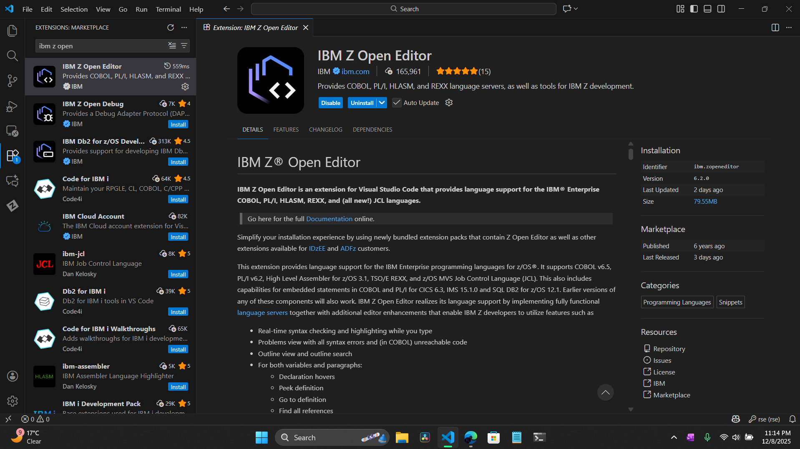
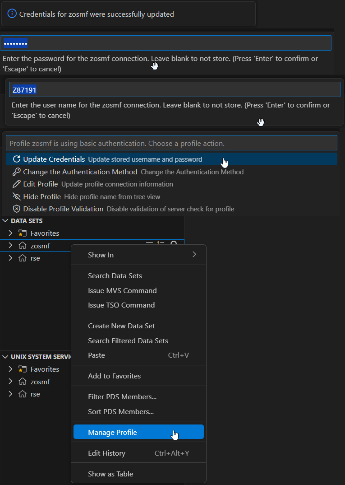

# Visual Guide – VSC1: Connect to Z

> Establish a connection to the IBM Z Mainframe using VS Code and Zowe Explorer.

---

## Step-by-Step Screenshots

### ✅ Step 1: Install Z Open Editor
*Installing the IBM Z Open Editor extension in VS Code. This automatically includes Zowe Explorer.*

---

### ✅ Step 2: Configure Zowe Profile
*Editing the `zowe.config.json` file to set the Host IP (204.90.115.200) and Port (10443).*

---

### ✅ Step 3: Update Credentials
*Adding the Z-ID and Password to the profile to authenticate with the mainframe.*

---

### ✅ Step 4: Filter Datasets
*Using the search/filter function to locate my specific Z-ID datasets (e.g., `Z#####`).*

---

### ✅ Step 5: Navigate to JCL and Submit Job
*Locating the `VSCJCL` member inside the `ZXP.PUBLIC.JCL` dataset.*
*Right-clicking the JCL member to "Submit Job" and verifying the connection.*

---

## What I Learned

- [cite_start]How to install and configure **IBM Z Open Editor** for VS Code [cite: 12]
- [cite_start]How to create and edit a **Zowe Team Configuration** file (`zowe.config.json`) [cite: 15]
- [cite_start]How to bypass self-signed certificate errors for lab environments (`rejectUnauthorized: false`) [cite: 17]
- [cite_start]How to navigate MVS datasets and submit JCL jobs without a green screen [cite: 29]

---

## Notes

- This lab is part of **IBM Z Xplore: Fundamentals**
- Performed using VS Code with Zowe Explorer extension
- Connected via port `10443` (z/OSMF)
- No VPN required; uses direct internet connection to the lab host

---

## Contact

**Paarth Pandey**
[LinkedIn](https://www.linkedin.com/in/paarth-pandey-13779529b/) | [GitHub](https://github.com/paarthpandey10) | paarthdxb@gmail.com

---

## Credits

This lab is based on the [IBM Z Xplore Learning Platform](https://ibmzxplore.influitive.com/), provided by IBM.
Visuals, objectives, and task flows belong to IBM and are used under fair use for personal learning documentation.

—

> Author: [Paarth Pandey](https://github.com/paarthpandey10)
>
> IBM Z Xplore: Fundamentals
