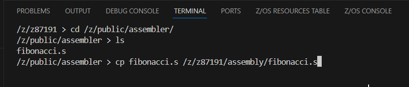
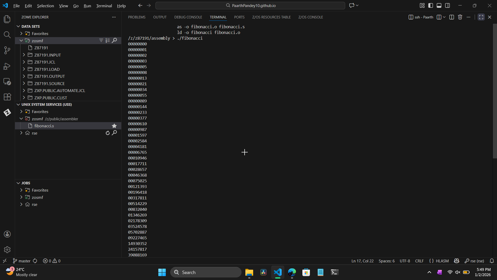
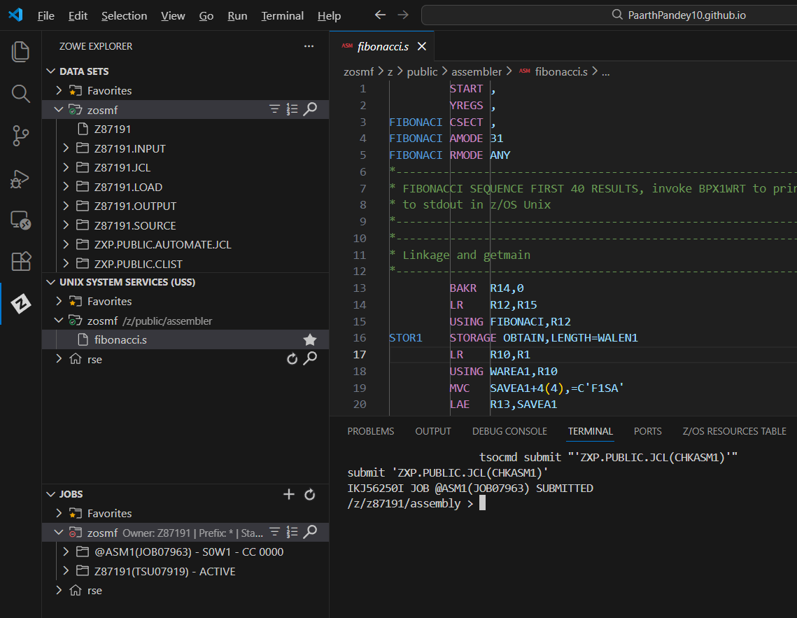

# Visual Guide – ASM1: Introduction to Assembler

> A step-by-step visual walkthrough of compiling and running Assembler code on z/OS.

---

## Step-by-Step Screenshots

### ✅ Step 1: Environment Setup
*Connecting to the mainframe. I used the VS Code terminal to SSH into the system and navigated to the `/z/public/assembler/` directory to locate the source file `fibonacci.s` before copying it to my local workspace.*

### ✅ Step 2: Assembling the Source
*Compiling the code. I ran `as -o fibonacci.o fibonacci.s`. [cite_start]This command invoked the Assembler to translate the human-readable mnemonics (like `MVC` and `BCT`) into a machine-readable object file (`.o`).* [cite: 206, 207]

### ✅ Step 3: Linking the Object
*Creating the executable. I executed `ld -o fibonacci fibonacci.o`. [cite_start]The linker took the object file and combined it with necessary system libraries to create a runnable program file named `fibonacci`.* [cite: 210, 211]

### ✅ Step 4: Execution
*Running the logic. I executed the program with `./fibonacci`. [cite_start]The screen displayed the first 38 numbers of the Fibonacci sequence (e.g., `00000000`, `00000001`, `00000002`... up to `63245986`), confirming the loop logic worked correctly.* [cite: 214, 229]

### ✅ Step 5: Final Validation
*Claiming the points. I submitted the validation JCL using `tsocmd submit "ZXP.PUBLIC.JCL(CHKASM1)"`. [cite_start]The job completed successfully, verifying that my Assembler program was built and run correctly.* [cite: 238]

---

## What I Learned

-   [cite_start]**The "Build" Pipeline:** How programs go from Source Code $\to$ Object File $\to$ Executable. This is similar to how C or Go programs are produced but done manually here to show the mechanics[cite: 19, 242].
-   [cite_start]**Direct Memory Access:** Unlike high-level languages that hide complexity, Assembler requires managing specific registers (like R2, R3, R5) and memory addresses directly[cite: 44, 158].
-   [cite_start]**System Calls:** How to use service programs like `BPX1WRT` to perform standard operations (like printing to the screen) because the CPU instructions themselves don't handle high-level I/O[cite: 191, 192].
-   [cite_start]**Linkage:** The importance of "standard linkage" conventions in allowing programs to hand off and regain control smoothly within the OS[cite: 102].

---

## Notes

-   **Source File:** `fibonacci.s`
-   **Executable:** `fibonacci`
-   **Key OpCodes:** `BCT` (Loop), `MVC` (Move Character), `BAS` (Branch and Save).

---

## Contact

**Paarth Pandey**
[LinkedIn](https://www.linkedin.com/in/paarth-pandey-13779529b/) | [GitHub](https://github.com/paarthpandey10) | paarthdxb@gmail.com

---

## Credits

This lab is based on the [IBM Z Xplore Learning Platform](https://ibmzxplore.influitive.com/), provided by IBM.
Visuals, objectives, and task flows belong to IBM and are used under fair use for personal learning documentation.

—

> Author: [Paarth Pandey](https://github.com/paarthpandey10)
>
> IBM Z Xplore: Advanced
