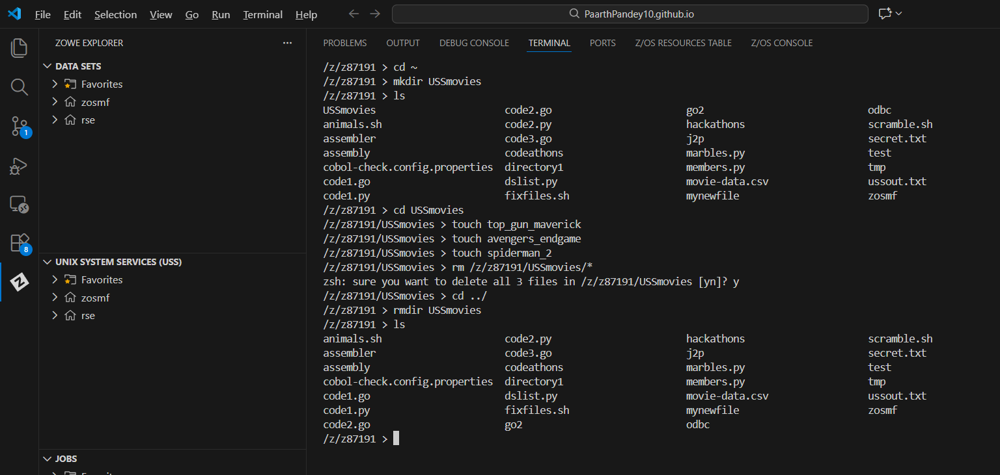
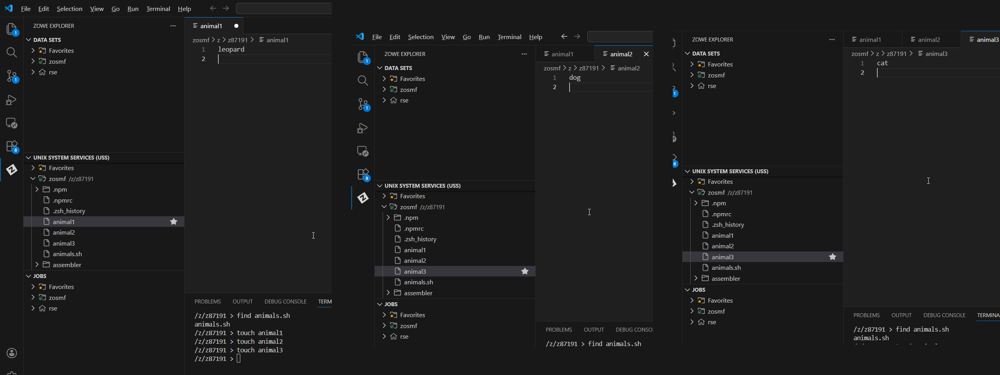
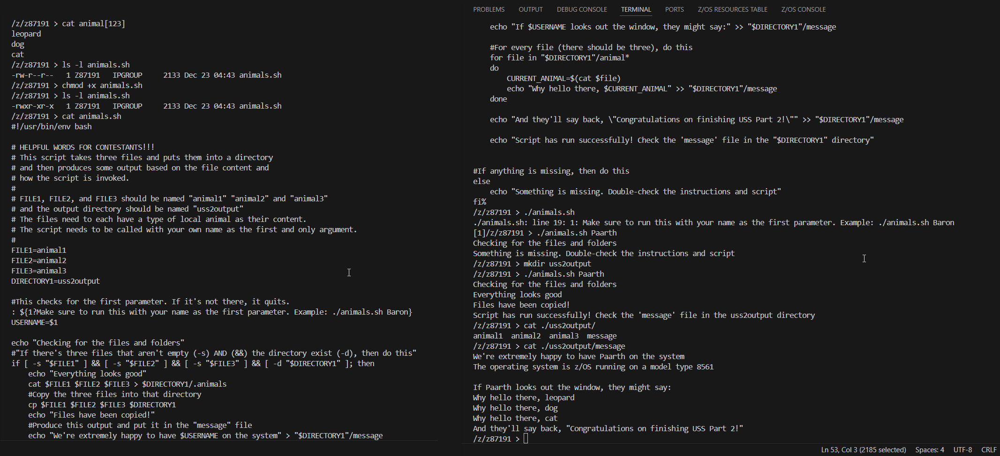

# Visual Guide – USS2: Advanced Shell Scripting

> A step-by-step visual walkthrough of CLI practice, environment setup, and script execution on z/OS UNIX.

---

## Step-by-Step Screenshots

### ✅ Step 1: CLI Refresher
*Warming up the command line skills. Before starting the main script challenge, I performed a practice routine: creating a directory named `USSmovies`, populating it with empty files (`touch top_gun_maverick`, etc.), and then successfully removing the directory and its contents using `rm` and `rmdir` to ensure I was comfortable with file system management.*

### ✅ Step 2: Preparing Input Data
*Setting up the dependencies. The `animals.sh` script required specific input files to function. I used `touch` to create `animal1`, `animal2`, and `animal3`. I then used the VS Code editor to populate them with local animals: "leopard", "dog", and "cat".*

### ✅ Step 3: Execution, Debugging & Verification
*The main execution logic. This screenshot captures the full workflow:*
1.  **Permissions:** Checked permissions with `ls -l` and added execute rights using `chmod +x animals.sh`.
2.  **Debugging:** Attempted to run the script (`./animals.sh Paarth`) but encountered a "Something is missing" error.
3.  **Fixing:** Realized the output directory was missing, so I ran `mkdir uss2output`.
4.  **Success:** Ran the script again. It detected all files and the directory, executed successfully, and I verified the output by reading the generated message (`cat ./uss2output/message`).

---

## What I Learned

-   **File Management:** Reinforcing creation and deletion commands (`mkdir`, `rmdir`, `touch`, `rm`).
-   **Troubleshooting:** Interpreting script error messages ("Something is missing") to identify missing prerequisites (the output directory).
-   **Permission Management:** Using `chmod +x` to transform a text file into an executable program.
-   **Verification:** Using `cat` to inspect both input files and the final output log to ensure data integrity.

---

## Notes

-   **Script:** `animals.sh`
-   **Inputs:** `animal1` (Leopard), `animal2` (Dog), `animal3` (Cat)
-   **Key Fix:** Manually creating the `uss2output` directory to allow the script to write logs.

---

## Contact

**Paarth Pandey**
[LinkedIn](https://www.linkedin.com/in/paarth-pandey-13779529b/) | [GitHub](https://github.com/paarthpandey10) | paarthdxb@gmail.com

---

## Credits

This lab is based on the [IBM Z Xplore Learning Platform](https://ibmzxplore.influitive.com/), provided by IBM.
Visuals, objectives, and task flows belong to IBM and are used under fair use for personal learning documentation.

—

> Author: [Paarth Pandey](https://github.com/paarthpandey10)
>
> IBM Z Xplore: Advanced
