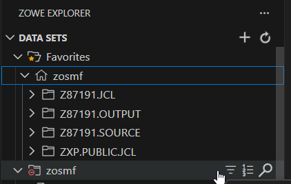
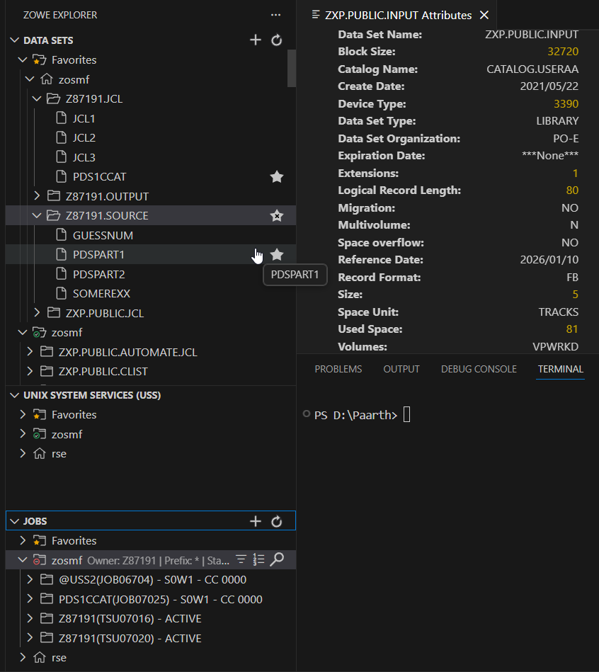
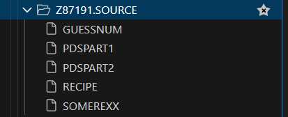
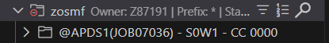

# PDS1 – Visual Walkthrough

> A step-by-step visual guide demonstrating the PDS1 challenge workflow using Zowe Explorer.

---

## 1. Environment Setup & filtering

*Setting up the High Level Qualifier (HLQ) to locate personal datasets. This view confirms the existence of the `Z87191.JCL` and `Z87191.SOURCE` datasets before population.*

---

## 2. Member Management & Attributes

*This screenshot captures two key achievements:*
1.  **Member Setup:** The `SOURCE` dataset now contains `PDSPART1` and `PDSPART2` (copied from public input) and `RECIPE` (renamed from `PDS1OUT` after running the JCL).
2.  **Inspection:** The right-hand panel displays the attributes of `ZXP.PUBLIC.INPUT`, confirming technical details like the Volume (`VPWRKD`) and Record Format (`FB`).

---

## 3. Final Dataset Structure

*A consolidated view of the `SOURCE` PDS. This verifies that the JCL successfully concatenated the parts to create the output, which was then manually renamed to `RECIPE` as per instructions.*

---

## 4. Validation

*The final verification step. The screenshot shows the Job Output panel where the validation job (`@APDS1`) completed with `CC 0000`, indicating all criteria for the challenge were met successfully.*

---

## Contact

For any questions or feedback, reach out:
**Paarth Pandey**
[LinkedIn](https://www.linkedin.com/in/paarth-pandey-13779529b/) | [GitHub](https://github.com/paarthpandey10) | paarthdxb@gmail.com

---

> Author: [Paarth Pandey](https://github.com/paarthpandey10)
>
> IBM Z Xplore - Advanced
