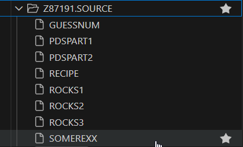
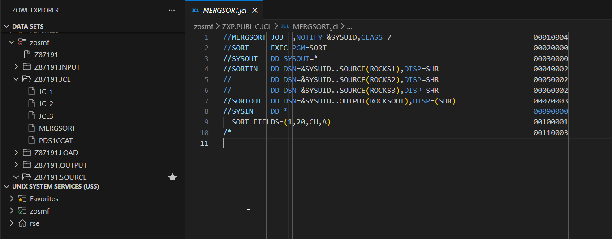
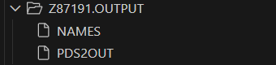
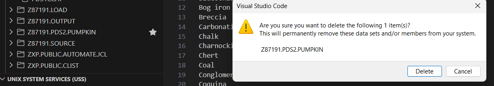
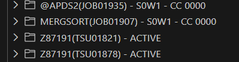

# PDS2 – Step-by-Step Visual Walkthrough

> A visual guide documenting the process of uploading, sorting, and managing mainframe datasets.

---

## Overview

This guide provides a visual narrative of the PDS2 challenge. It follows the process from uploading local data to the mainframe, processing it with JCL, and performing necessary cleanup operations for validation.

---

## Workflow Steps

### 1. Populating the Source
We began by uploading local text files containing lists of geological data. [cite_start]The screenshot below shows the `Z87191.SOURCE` dataset after successfully uploading `ROCKS1`, `ROCKS2`, and `ROCKS3`[cite: 44, 46].

### 2. Configuring the Sort Job
The `MERGSORT` JCL was used to process the data. Note the use of `&SYSUID` on lines 4-7. [cite_start]This symbolic variable automatically inserts the user ID (`Z87191`) at runtime, allowing the script to locate the input files and direct the output to `OUTPUT(ROCKSOUT)`[cite: 56, 63].

### 3. Verifying the Sort Output
After submitting the job, we inspected the generated member `ROCKSOUT`. [cite_start]The data was successfully merged and sorted alphabetically, confirming the `SORT FIELDS=(1,20,CH,A)` instruction worked as intended[cite: 60, 151].

### 4. Renaming the Output
[cite_start]To meet the specific validation criteria of the challenge, the output member `ROCKSOUT` inside `Z87191.OUTPUT` was renamed to `PDS2OUT`[cite: 152].

### 5. Housekeeping
Good mainframe hygiene requires cleaning up unused resources. [cite_start]We deleted the temporary dataset `Z87191.PDS2.PUMPKIN` created earlier in the challenge to ensure a clean validation state[cite: 161].

### 6. Final Validation
The `CHKAPDS2` validation job (shown as `@APDS2`) was submitted. [cite_start]The return code `CC 0000` confirms all steps—upload, sort, rename, and cleanup—were executed correctly[cite: 162].

---

## Contact

For any questions or feedback, reach out:
**Paarth Pandey**
[LinkedIn](https://www.linkedin.com/in/paarth-pandey-13779529b/) | [GitHub](https://github.com/paarthpandey10) | paarthdxb@gmail.com

---

> Author: [Paarth Pandey](https://github.com/paarthpandey10)
>
> IBM Z Xplore - Advanced
