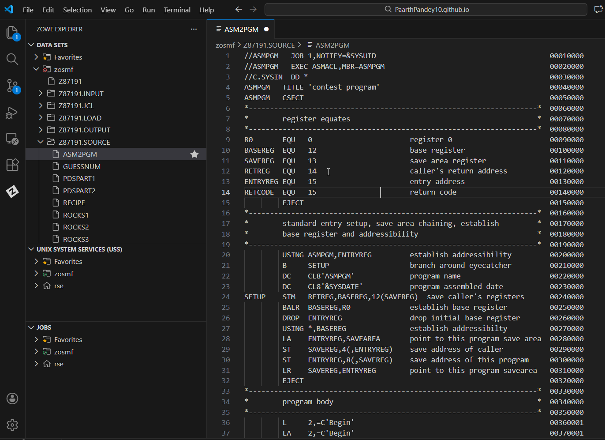
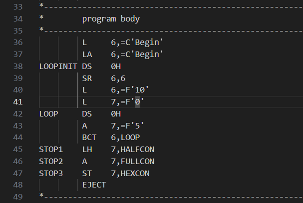
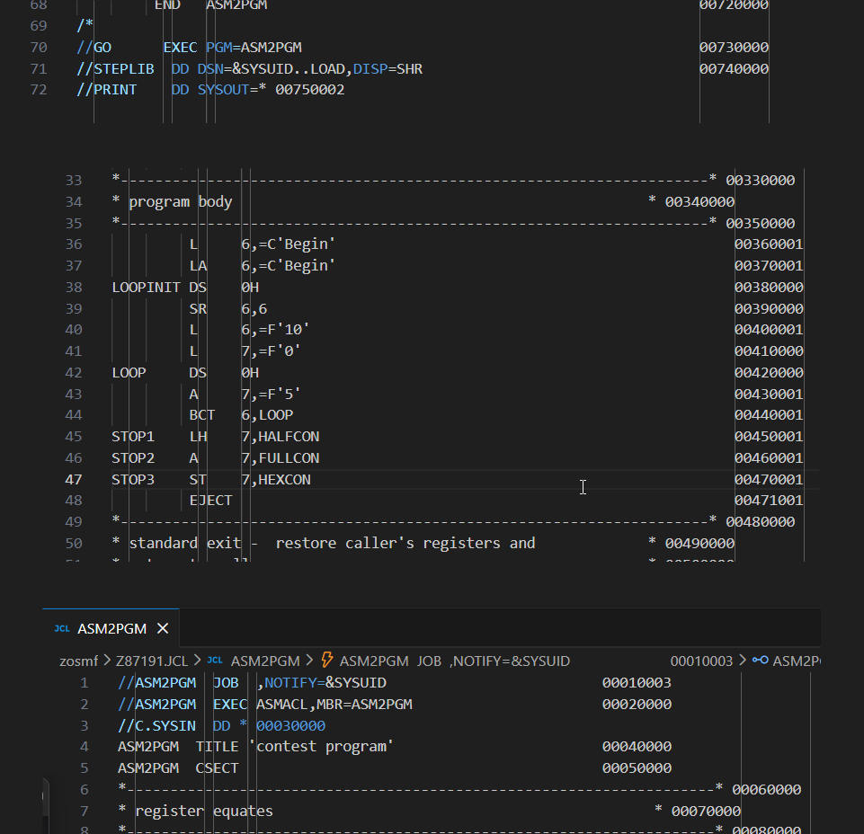
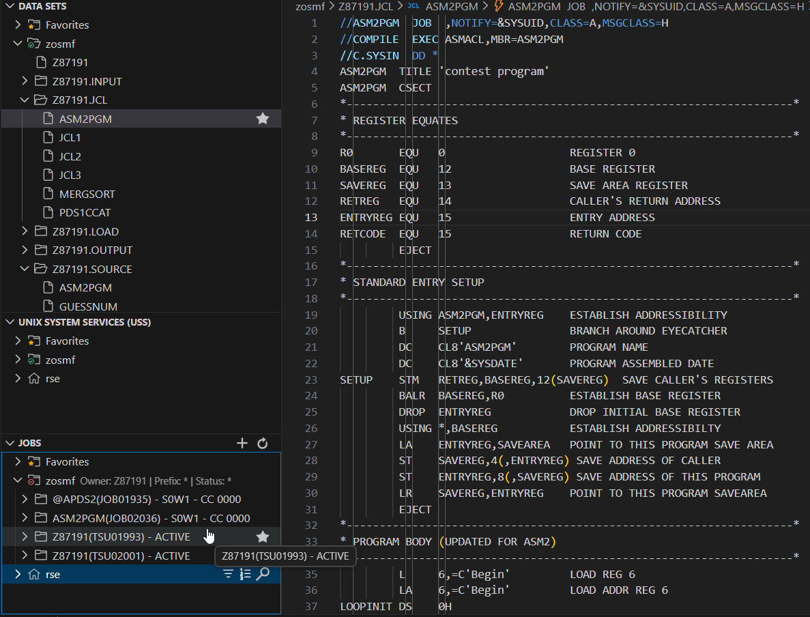
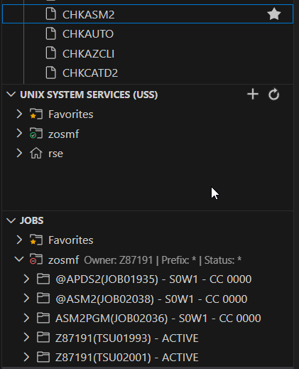

# ASM2 – Step-by-Step Visual Walkthrough

> A visual guide documenting the process of modifying, compiling, and validating IBM Z Assembler code.

---

## Overview

This guide provides a visual narrative of the ASM2 challenge. It follows the process from cloning the base Assembler program to modifying its internal logic and registers, and finally validating the output.

---

## Workflow Steps

### 1. Setup and Source Creation
We began by creating the `ASM2PGM` member in our `SOURCE` dataset. The image below shows the initial structure of the program before the logic parameters were altered.

### 2. Modifying Logic & Registers
The core task involved editing the Assembler instructions. As seen below, we swapped Register 2 for Register 6 and Register 3 for Register 7. We also updated the loop to run 10 times (`F'10'`) and increment the sum by 5 (`F'5'`) during each pass.

### 3. JCL Configuration
The JCL was configured to compile the new `ASM2PGM` member. The screenshot shows the `MBR=ASM2PGM` parameter, ensuring the output load module is correctly named.

### 4. Compilation & Execution
The `ASM2PGM` job was submitted to the system. The output below confirms the job ran with `CC 0000`, indicating no syntax errors or execution crashes.

### 5. Final Validation
To complete the challenge, the `CHKASM2` validation job (displayed as `@ASM2`) was submitted. The Return Code `0000` verifies that the register usage and loop calculation results met the challenge specifications.

---

## Contact

For any questions or feedback, reach out:
**Paarth Pandey**
[LinkedIn](https://www.linkedin.com/in/paarth-pandey-13779529b/) | [GitHub](https://github.com/paarthpandey10) | paarthdxb@gmail.com

---

> Author: [Paarth Pandey](https://github.com/paarthpandey10)
>
> IBM Z Xplore - Advanced
