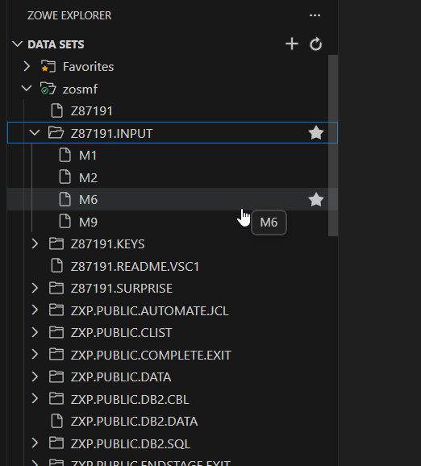
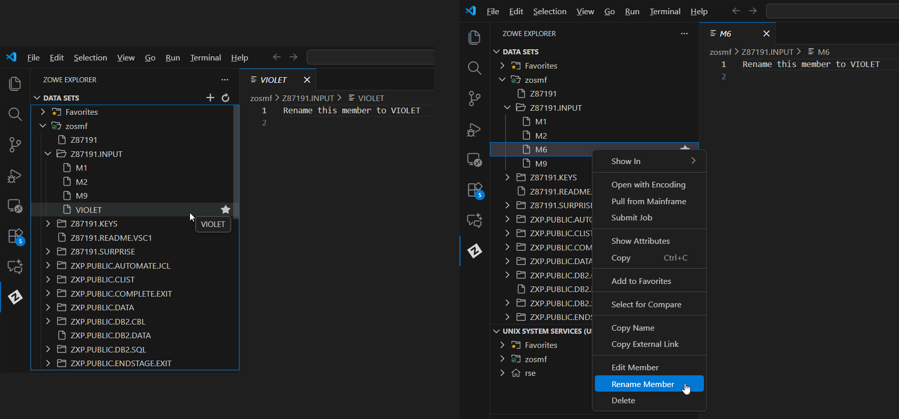
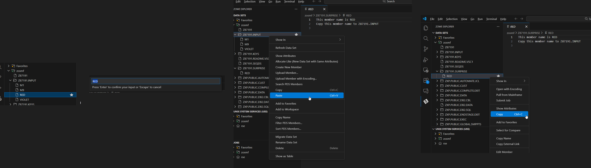
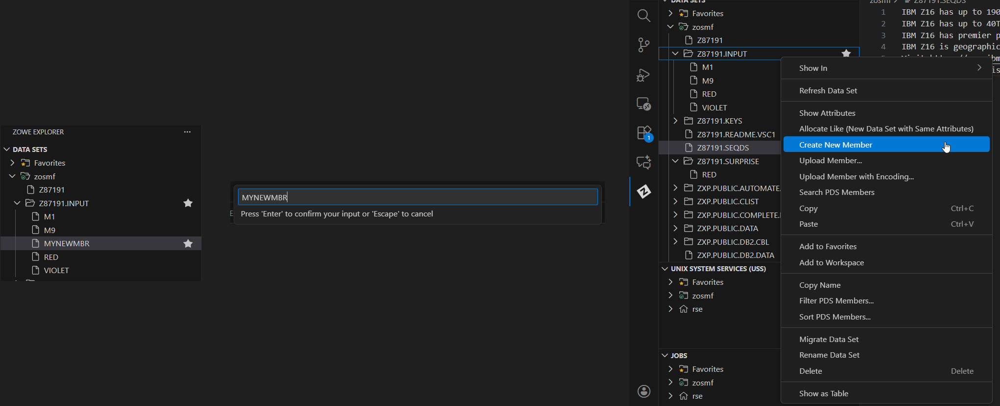
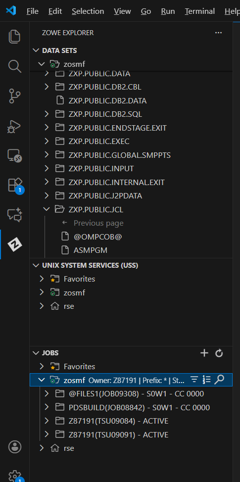

# Visual Guide – FILES1: Dataset Management

> A step-by-step visual walkthrough of managing IBM Z datasets using VS Code.

---

## Step-by-Step Screenshots

### ✅ Step 1: Filter Setup
*Creating a combined filter to view both my personal datasets (`Z87191`) and the public lab datasets (`ZXP.PUBLIC`) in one view.*

---

### ✅ Step 2: Initialize Environment
*Submitting the `PDSBUILD` job from `ZXP.PUBLIC.JCL`. This job allocates the required datasets and members for the lab.*

---

### ✅ Step 3: Verify Creation
*Opening `Z87191.INPUT` to confirm the PDS was created and contains the initial members (M1, M2, M6, M9).*

---

### ✅ Step 4: Rename Member
*Right-clicking member `M6` and renaming it to `VIOLET`.*

---

### ✅ Step 5: Delete Member
*Deleting the obsolete member `M2` from the `INPUT` PDS.*

---

### ✅ Step 6: Copy & Paste Member
*Copying the member `RED` from the `SURPRISE` dataset and pasting it into `Z87191.INPUT`.*

---

### ✅ Step 7: Create New Member
*Creating a new empty member named `MYNEWMBR` inside `Z87191.INPUT`.*

---

### ✅ Step 8: Edit Sequential File
*Modifying the Sequential Data Set `Z87191.SEQDS` to include custom text.*

---

### ✅ Step 9: Final Validation
*Checking the Job Output to confirm the `@FILES1` validation job (and `PDSBUILD`) completed successfully with Condition Code 0000.*

---

## What I Learned

- How to **Copy, Rename, and Delete** PDS members using the Zowe GUI.
- The difference between **Partitioned Data Sets (PDS)** and **Sequential Data Sets**.
- How to initialize a lab environment using a setup JCL (`PDSBUILD`).
- How to interpret Job Return codes (CC 0000) in the Zowe Jobs view.

---

## Notes

- **PDS (Partitioned Data Set):** Like a folder containing files (members).
- **Sequential Data Set:** Like a single flat file.
- All operations were performed real-time on the mainframe via the z/OSMF API.

---

## Contact

**Paarth Pandey**
[LinkedIn](https://www.linkedin.com/in/paarth-pandey-13779529b/) | [GitHub](https://github.com/paarthpandey10) | paarthdxb@gmail.com

---

## Credits

This lab is based on the [IBM Z Xplore Learning Platform](https://ibmzxplore.influitive.com/), provided by IBM.
Visuals, objectives, and task flows belong to IBM and are used under fair use for personal learning documentation.

—

> Author: [Paarth Pandey](https://github.com/paarthpandey10)
>
> IBM Z Xplore: Fundamentals
