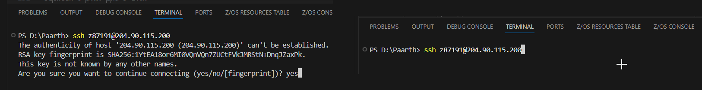
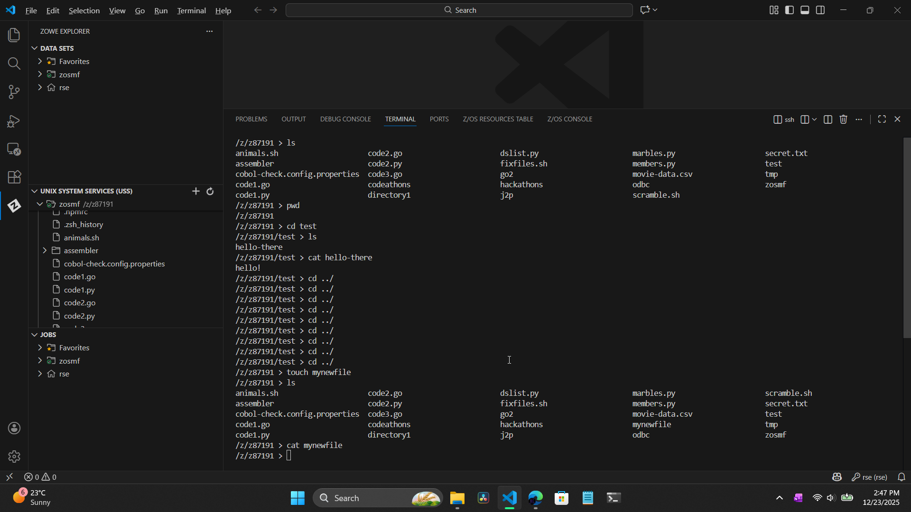
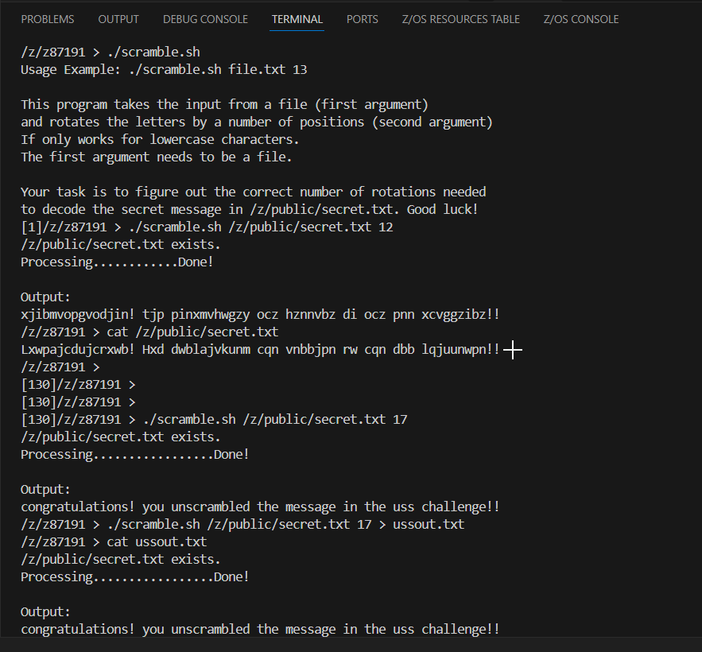
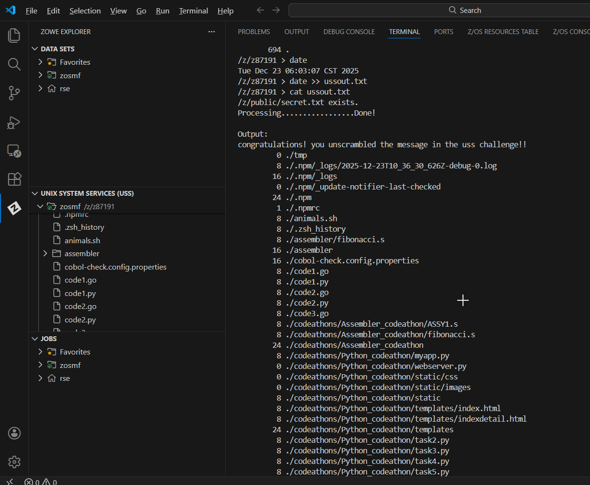

# Visual Guide – USS1: UNIX System Services

> A step-by-step visual walkthrough of using the UNIX shell on IBM Z to solve the scramble challenge.

---

## Step-by-Step Screenshots

### ✅ Step 1: Connect via SSH
*Opening the integrated terminal in VS Code and connecting to the z/OS system using the SSH protocol. This establishes a secure text-based session with the mainframe.*

---

### ✅ Step 2: Workspace Initialization
*Running the `uss-setup` command. This script populates the previously empty home directory with the Python scripts and Shell scripts required for the challenge.*

---

### ✅ Step 3: Navigating and Inspecting
*Using `ls -l` to list files with details. Note the `x` (executable) permission on `scramble.sh`, indicating it is a program we can run.*

---

### ✅ Step 4: The Scramble Challenge
*Running `./scramble.sh /z/public/secret.txt 9`. The script takes a file path and a number (rotation key) as arguments. Through trial and error (deduction), the correct rotation key was found to be 9, revealing the readable text.*

---

### ✅ Step 5: Redirecting Output
*Once the code was broken, I used the redirection operator `>` to save the output to `ussout.txt` instead of printing it to the screen. This created the validation file.*

---

### ✅ Step 6: Appending System Data
*To complete the log, I used the append operator `>>` to add the output of `du -ak` (disk usage in kilobytes) and `date` (current timestamp) to the bottom of `ussout.txt` without overwriting the decoded message.*

---

### ✅ Step 7: Zowe USS Explorer
*Verifying the file creation using the Zowe Explorer extension GUI. This allows for easy viewing and editing of UNIX files directly within the VS Code editor interface.*

---

## What I Learned

- **SSH (Secure Shell):** How to remotely access the z/OS UNIX command line interface.
- **The "Everything is a File" Philosophy:** Treating scripts, text, and directories as standard UNIX objects.
- **I/O Redirection:** The power of `>` and `>>` to chain commands and save outputs for logging or auditing.
- **Hybrid Nature of z/OS:** Realizing that the mainframe supports modern open standards (POSIX) alongside traditional JCL/COBOL workflows.

---

## Notes

- **Tab Completion:** Used the `Tab` key to auto-complete long filenames like `directory1` and `scramble.sh`, speeding up the workflow.
- **Home Directory:** The tilde `~` shortcut was used to quickly return to the home directory (`/z/z#####`) from deep within the file structure.

---

## Contact

**Paarth Pandey**
[LinkedIn](https://www.linkedin.com/in/paarth-pandey-13779529b/) | [GitHub](https://github.com/paarthpandey10) | paarthdxb@gmail.com

---

## Credits

This lab is based on the [IBM Z Xplore Learning Platform](https://ibmzxplore.influitive.com/), provided by IBM.
Visuals, objectives, and task flows belong to IBM and are used under fair use for personal learning documentation.

—

> Author: [Paarth Pandey](https://github.com/paarthpandey10)
>
> IBM Z Xplore: Fundamentals