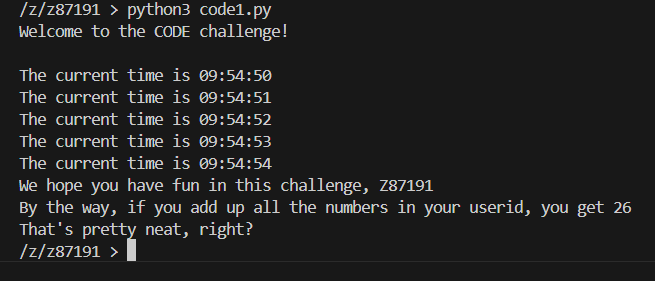
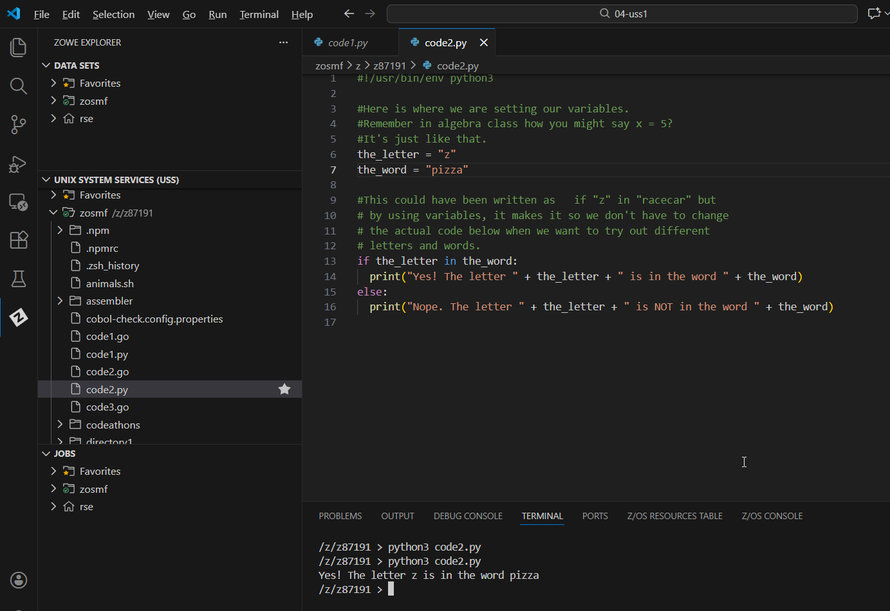
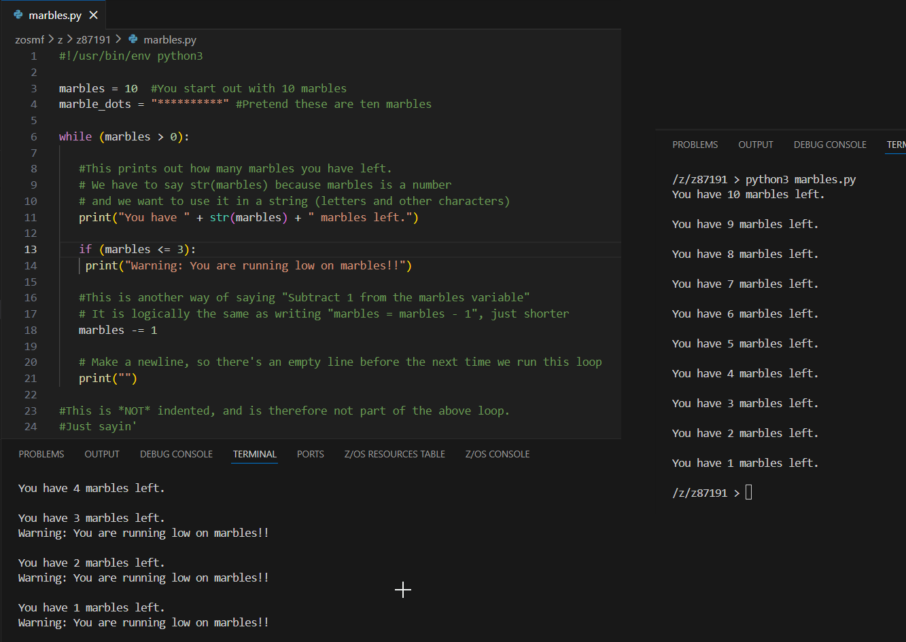
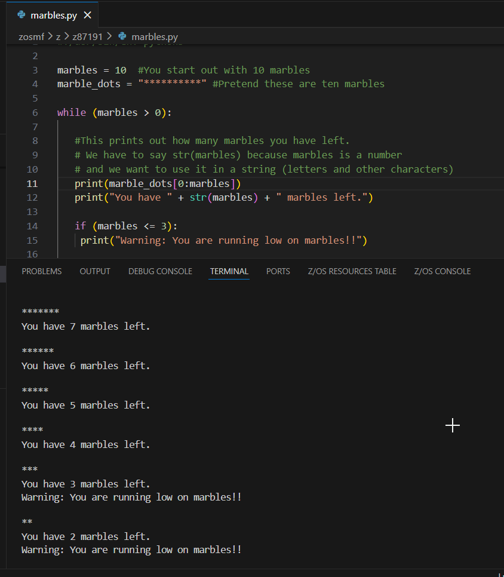
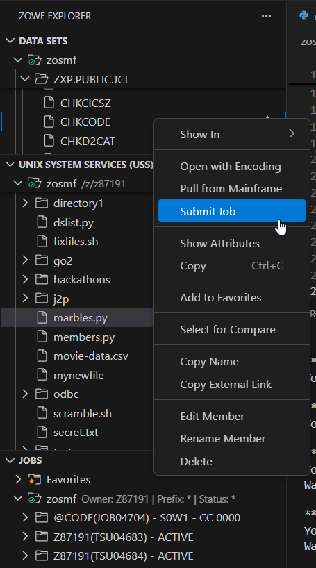

# Visual Guide – CODE1: Python on z/OS

> A step-by-step visual walkthrough of running Python scripts and logic on IBM Z.

---

## Step-by-Step Screenshots

### ✅ Step 1: Running Your First Python Script
*Executing `code1.py` in the terminal. The script outputted the current time in a loop and calculated a "magic number" (26) by summing the digits of my User ID (z87191).*

### ✅ Step 2: Variables and Conditionals
*Editing `code2.py` in VS Code. This step introduced setting variables (like `the_word = "pizza"`) and using `if/else` statements to check if a specific letter existed within that string.*

### ✅ Step 3: The Marbles Logic (Loops)
*Working with `marbles.py`. I set up a `while` loop to decrement a counter from 10. The code uses string concatenation to print the status of how many marbles are left.*

### ✅ Step 4: String Slicing & Warnings
*Refining the `marbles.py` output. I used list slicing (`marble_dots[0:marbles]`) to visually represent the marbles as asterisks. I also added a check `if (marbles <= 3)` to trigger a "running low" warning.*

### ✅ Step 5: Final Logic & Validation
*The final state of `marbles.py`. It includes the logic to decrement the count (`marbles -= 1`) and prints "You are all out of marbles" once the loop finishes. Finally, I submitted the validation job via Zowe.*

### ✅ Step 6: JCL Submission
*Using the Zowe Explorer extension to submit the `CHKCODE` job from the `ZXP.PUBLIC.JCL` data set to verify the work.*

---

## What I Learned

- **Python on Mainframe:** Confirmed that z/OS has a native Python interpreter (`python3`), making it accessible for modern developers.
- **VS Code Integration:** I can edit Python files directly on the mainframe using the VS Code editor and run them in the integrated terminal.
- **Logic Structures:** Implemented standard programming concepts like `while` loops, `if` statements, and string slicing within the z/OS environment.
- **Zowe Explorer:** efficient job submission (`CHKCODE`) directly from the GUI.

---

## Notes

- **User ID:** `z87191`
- **Files Edited:** `code1.py`, `code2.py`, `marbles.py`

---

## Contact

**Paarth Pandey**
[LinkedIn](https://www.linkedin.com/in/paarth-pandey-13779529b/) | [GitHub](https://github.com/paarthpandey10) | paarthdxb@gmail.com

---

## Credits

This lab is based on the [IBM Z Xplore Learning Platform](https://ibmzxplore.influitive.com/), provided by IBM.
Visuals, objectives, and task flows belong to IBM and are used under fair use for personal learning documentation.

—

> Author: [Paarth Pandey](https://github.com/paarthpandey10)
>
> IBM Z Xplore: Fundamentals
